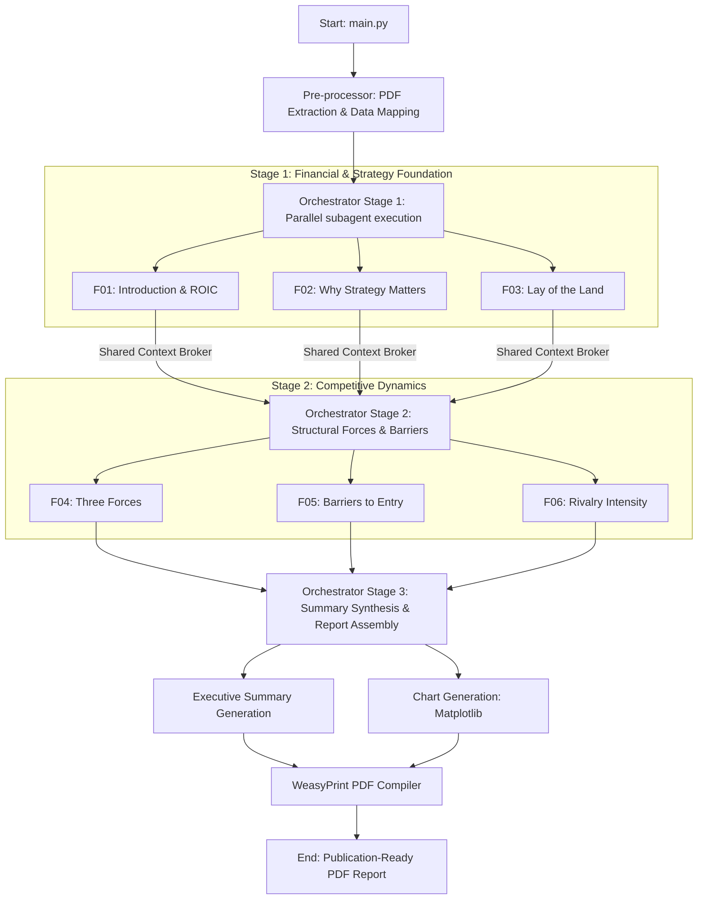

# 📊 Hedge Fund Qualitative Research Agent Pipeline

An institutional-grade, multi-agent AI pipeline designed to conduct deep qualitative equity research and competitive analysis on listed companies (focused on the Indian market but extensible globally). 

By combining rigorous quantitative financial anchors (e.g., ROIC, WACC, market shares) with deep qualitative assessments using specialized subagents, the pipeline generates a unified, publication-quality executive research report in PDF format.

---

## 🏛️ Pipeline Architecture

The pipeline uses a coordinated multi-agent orchestration architecture divided into three key phases, managed by a centralized, thread-safe `ContextBroker`:



---

## 🤖 The F01–F06 Subagent Framework

Every subagent acts as an expert analyst specialized in a particular layer of qualitative company research, combining custom LLM prompts with programmatic quantitative data:

| Agent | Module | Description / Programmatic Anchors |
| :--- | :--- | :--- |
| **`F01`** | **Introduction & ROIC Foundation** | Establishes focal company ROIC trends vs. WACC and future value component ratio calculations. |
| **`F02`** | **Why Strategy Matters** | Evaluates strategic positioning relative to the industry by comparing historical peer ROIC series. |
| **`F03`** | **Lay of the Land** | Measures market share structure, industry consolidation, and focal company dominance. |
| **`F04`** | **Three Forces** | Focuses on Supplier Bargaining Power, Buyer Bargaining Power, and Substitution Threats. |
| **`F05`** | **Threat of New Entrants** | Computes programmatic barriers to entry (Network Effects, Asset Specificity, Regulatory Moat). |
| **`F06`** | **Rivalry Among Existing Firms** | Gauges Tacit Coordination potential, firm similarity, exit barriers, and cost structure dynamics. |

---

## 🎨 Visuals & Professional Report Design

The pipeline generates publication-quality assets and compiles them using a dedicated **CSS/HTML Paged Media** design:
*   **Automatic Chart Generation**: Integrates three standard institutional-grade navy-themed `matplotlib` charts:
    1.  *ROIC vs. WACC Trend Chart* with positive/negative spread color-fill highlights.
    2.  *Peer ROIC Comparison Chart* displaying multi-year comparative bar graphs.
    3.  *Proxy Market Share Chart* depicting listed universe share stacks over time.
*   **HTML-to-PDF Assembly (`WeasyPrint`)**: Builds reports on A4 layouts with embedded CSS including professional page headers/footers, dynamic counter pages, custom key finding callout blocks, and confidence data-flag warnings.
*   **LLM Synthesis**: Uses an executive summary generator to run high-level qualitative cross-referencing and compile structured insights.

---

## 📁 Repository Structure

```directory
.
├── config.yaml          # Pipeline and model configuration parameters
├── main.py              # Main execution entrypoint
├── requirements.txt     # Project python dependencies
├── llm/                 # LLM Client wrapper for Ollama local models
├── orchestrator/        # Phase management, ThreadPool, and ContextBroker
├── preprocessor/        # PDF extraction, segment alignment, and data tagging
├── templates/           # Report templates & Jinja HTML blueprints
│   └── prompts/         # Individual expert system prompts (F01-F06)
├── tools/               # Shared utilities (Calculators, Chart/PDF engines, Scorer)
└── [Directories ignored in git]
    ├── input/           # Source PDFs (Annual reports, transcripts, filings)
    ├── logs/            # Runtime log files
    ├── output/          # Generated final PDF reports
    ├── processed/       # Extracted JSON chunks and context packages
    └── state/           # Temporary pipeline state tracking
```

---

## ⚡ Quick Start

### 1. Prerequisites

*   **Python**: Version `3.10` or higher is recommended.
*   **Ollama**: Installed and running locally. Pull your target model (e.g., Llama 3.3 70B):
    ```bash
    ollama pull llama3.3:70b
    ```
*   **System Dependencies**: `WeasyPrint` requires system-level libraries for PDF generation (Pango, cairo, etc.). Follow the [WeasyPrint installation guide](https://doc.weasyprint.org/en/stable/first_steps.html) for your specific OS.

### 2. Configuration & Setup

1.  Clone this repository.
2.  Install Python dependencies:
    ```bash
    pip install -r requirements.txt
    ```
3.  Set up local environment variables:
    ```bash
    cp .env.example .env
    ```
    *Modify `.env` to configure your `OLLAMA_BASE_URL` or supply a `LLAMA_CLOUD_API_KEY` for advanced PDF parsing.*
4.  Configure `config.yaml` to specify the focal company ticker, comparative peers, date ranges, and model specifications.

### 3. Running the Pipeline

Ensure your source PDFs are loaded under `input/<TICKER>/` (annual_reports, exchange_filings, presentations, transcripts) and run:
```bash
python main.py
```

All extracted assets, subagent calculations, intermediate context JSON packages, and the final compiled research PDF report will be saved inside `output/` and `processed/` directories.
